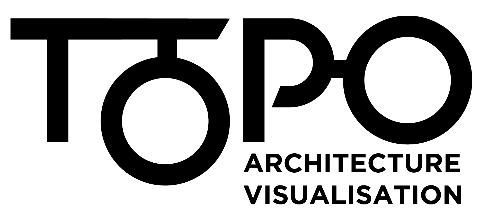

<h1 align="center">TOPO</h1>
<br/>

<p align="center">
  
</p>
<br/>
<br/>


## Description
> At a number of clients we're doing serious Enterprise Architecture (in title case), in particular helping with the establishment of a town plan - business capability model, mapped to systems, data, ownership, health, dependencies and other attributes.

## Development
The project is split into Client, Server and Database. There is a docker compose file to spin an instance for all of them up.
```
yarn docker-dev up
``` 
The client starts up under http://localhost:5000

The server http://localhost:4000

The database browser interface http://localhost:7474/browser/

### Setup Client locally 
It's very slow and inconvenient to have to re-build the docker images every time
you make a change. So instead we recommend running the client in dev mode
locally. This means that you end up with two versions of the client (on ports
5000 and 3000) but with the added convenience of hot-reloading and all that
good stuff.

Go into client folder
Run `yarn install` to install all the dependencies

### Test
Use `yarn test` to launch the test runner in the interactive watch mode.

## Decision Register

We document our decisions in the *doc/adr/* directory. Use [adr-tools](https://github.com/npryce/adr-tools) to automate creating a new decision register file for your decision. More details in the wiki.

## License

Topo is released under [Apache 2.0 License](https://www.apache.org/licenses/LICENSE-2.0)

## Copyright

Copyright 2018 ThoughtWorks, Inc.
