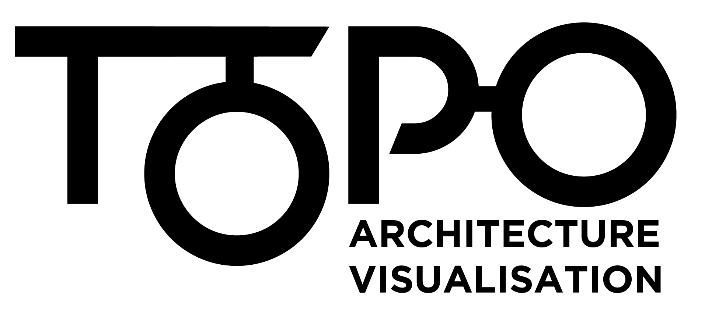

<p align="right">
  
</p>
<br />

<p align="center">
  
</p>


<br/>

## Description
Topo is a _reference implementation_ of an automated architecture repository - aggregating curated and live information about an organisation's software systems - what they are, how they are grouped together, and how they relate to each other.

## Starting topo locally

```
yarn docker-local up
```

The topo GraphQL server is available on http://localhost:4000
The neo4j browser is available on http://localhost:7474/browser/

A second instance of neo4j is started, and used when running integration tests (it starts on :7473, but is not exposed).
This is done because NEO doesn't support the concept of multiple databases on the same server and we want to setup and tear down the database components on each test run.

#### Local dev with Tilt
To install follow [this](https://github.com/tilt-dev/tilt#install-tilt) page.

Then run `tilt up` , `ctrl + c` in the terminal then `tilt down` to stop.

### Run the tests

Use `yarn test` to run unit tests. `yarn test-int` will run the integration tests.

# Decision Register

We document our decisions in the *doc/adr/* directory. Use [adr-tools](https://github.com/npryce/adr-tools) to automate creating a new decision register file for your decision.

Once you have the tool installed to make a new ADR simply run..

```bash
adr new Title of New Decision
```

## License

Topo is released under [Apache 2.0 License](https://www.apache.org/licenses/LICENSE-2.0)

## Copyright

Copyright 2018-20 ThoughtWorks, Inc.
